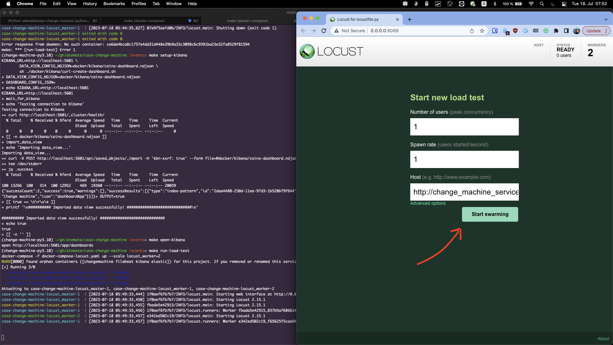
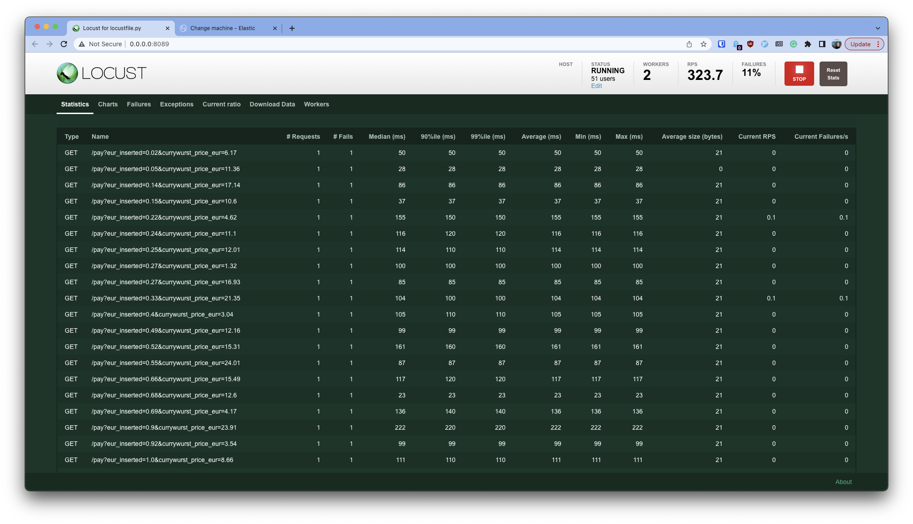
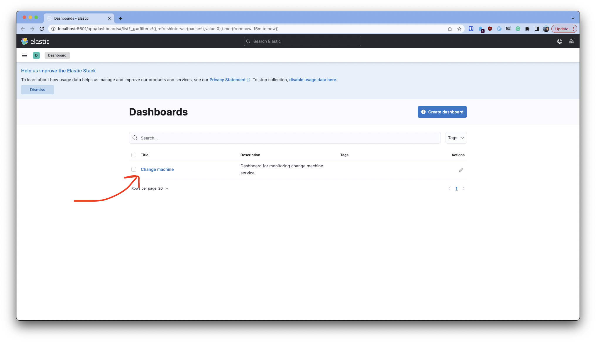
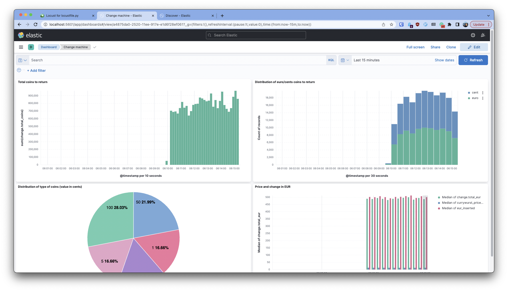
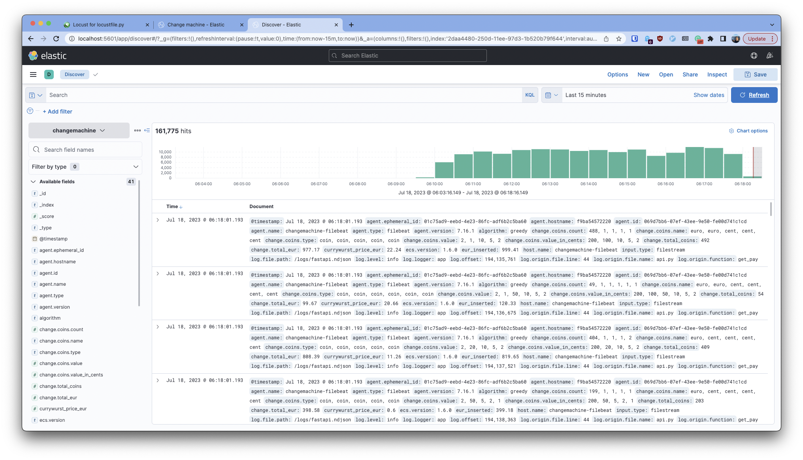
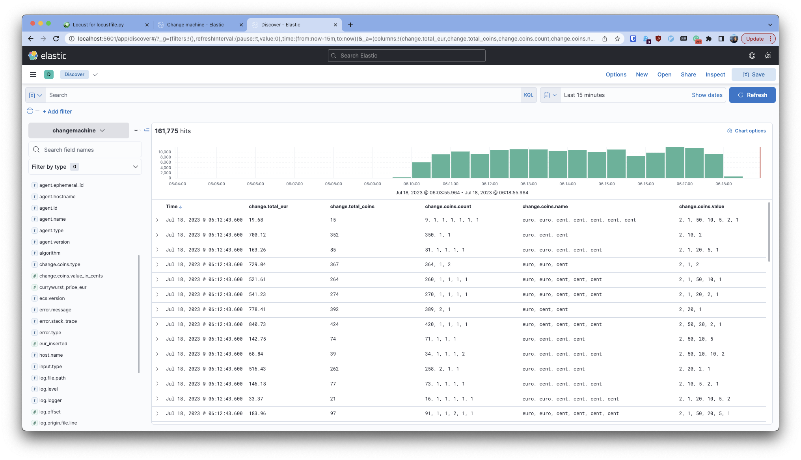

# case-change-machine-api
Use-case for a REST API service returning the minimum amount of coins for change for a product price in EUR:
```python
def return_coins(product_price_eur: float, eur_inserted: float) -> dict:
    ...
```


- See algorithm requirements and implementations (Greedy and Dynamic Programming) in [src/chg-package/README.md](src/chg-package/README.md).
- See REST API specification in [src/chg-service/README.md](src/chg-service/README.md) 


## Local development
- Requirements:
    - Python 3.10 (install via pyenv)
    - Poetry (`pip install -U poetry`)

- Install local dependencies:
```
make install
```

- Run unit tests:
```
make unit-tests
```

### Run as standalone server
- Run in docker-compose:
```
make run-docker
docker-compose -f ./docker-compose-single.yaml up --build
[+] Building 1.9s (8/8) FINISHED
 => [internal] load build definition from Dockerfile                                                                                                                                                                                                                       0.0s
 => => transferring dockerfile: 32B
...
^C
```

In a separate terminal:
```
$ curl 'localhost:3003/pay?eur_inserted=15&product_price_eur=4.9' | jq
{
  "total_coins": 6,
  "total_eur": 10.1,
  "coins": [
    {
      "count": 5,
      "value": 2,
      "value_in_cents": 200,
      "name": "euro",
      "type": "coin"
    },
    {
      "count": 1,
      "value": 10,
      "value_in_cents": 10,
      "name": "cent",
      "type": "coin"
    }
  ]
}
```

Cleanup:
```
make run-docker
```

### Deployment with log collection
As the last part of the task we were asked to persist the history of transactions in order to be able to control if everything works properly:
- After the payment transaction is processed by the REST API, but before returning the result, create and dispatch a new event to notify about the
transaction.
- Choose a persistent storage technology to store the events.
- Start this new service in another container, allowing the REST API to send events to it.


---
Obviously, semi-structured json payloads must be stored in a no-SQL database optimized for append-only writes of immutable items, and being able to store data for long time for little cost (e.g. MongoDB or DocumentDB).
The main question is the transport for the messages.


#### Solution 1: (async) Message Queues
First solution that comes to mind is to connect the service with a database via a message queue (RabbitMQ, SQS, PubSub), task queue (Celery) or a streaming service (Kafka, Kinesis).
The latter services can sometimes store messages for some period and offer SQL-like functionality to query historical data for analytics, however this comes at higher processing costs.

See [this repo](https://github.com/Fidget-Spinner/fastapi-celery-redis/) as an example of such a setup:
1. FastAPI service `main.py` is connected to Celery,
2. on the other side, Celery workers `celery_worker.py` process messages (persist them into a database, for example Redis or MongoDB),
3. Celery uses Redis as message transport (`celery_app.py`)

Advantages:
- highly scalable, asyncronous

Disadvantages:
- one more service (celery workers connected to a DB) to implement and maintain
- definitely an overkill for just logging (no need low latency for analytics)


#### Solution 2: (sync) Separate custom REST API or DB directly
Alternatively, one could implement a separate custom REST API microservice that would receive a payload and write it to a DB.
In a simpler setup, one could even connect the main service directly to the database. Both cases would solve the logging issue, however it would be tricky to scale such solution if needed, and also to build it robust and responsive.


#### Solution 3: (async, chosen) Log aggregation tool
The most natural solution for logging the payloads and processing results is to process the server logs.
It could be done with a centralised logging service that would run lightweigh sidecar containers next to each microservice's pod and collect the log entries (possibly with some time delay), and offer righ analytics functionality. Such solutions are: Logstash or Filebeat(+Elasticsearch +Kibana) or fluentd (+for example DataDog).

---

In this exercise, we implemented [Filebeat](https://www.elastic.co/beats/filebeat) with Elasticsearch as a "database for logs" and Kibana as a rich user interface for working with data. Filebeat was used instead of traditional Logstash because it is much lighter and easier to use (Logstash runs a JVM and requires much more resources, however it provides rich data transformation capabilities).

The beauty of this solution is that:
- it requires almost no changes on microservice side, just configure logs to be written to a file or another collector in a structured way,
- it is cheap and adds almost no overhead (every service still writes logs),
- is scalable and robust,
- when needed, can still be connected to message queues or more advanced log processors (for example to persist logs to other places)

](./images/filebeat.png)

In our setup, the data is **persisted to docker volumes**, which can be replaced with K8s PersistentVolumes in a production setup.
For my knowledge, ELK-based logging system does not provide persistance other than log files, however, as mentioned above, ELK can be easily connected to other databases via message queues.

*Note*: The infamously known [license issue](https://www.elastic.co/pricing/faq/licensing) with Elasticsearch and Kibana might be an obstacle for some production systems, but there are some alternatives for text search like [Loki](https://alexandre-vazquez.com/loki-vs-elk/) or [Solr](https://logz.io/blog/solr-vs-elasticsearch/) which need additional research.


#### Instructions
The setup was tested on macOS 12.5.1 (Darwin 21.6.0), M1 core.
```
$ colima --version
colima version 0.5.5

$ docker --version
Docker version 23.0.0, build e92dd87c32

$ docker-compose --version
Docker Compose version 2.16.0
```

**WARNING**: The setup is for demo purposes, many security features are disabled, do NOT run in production systems.


- Run ELK (strictly speaking EFK, with Filebeat instead of Logstash) services and our change machine microservice (see [docker-compose-elk.yaml](docker-compose-elk.yaml))
```
$ make run-docker-elk
...
(press ^C to abort and kill all containers)
```

- In a separate terminal, run load tests [load-test/locustfile.py](load-test/locustfile.py)
```
$ make run-load-test
...
(press ^C to abort and kill all containers)
```


- Open http://0.0.0.0:8089/ and click "Start swarming", this will start the load test:


- In another terminal, run `make setup-kibana` to load the pre-configured the Kibana dashboard.

- Run `make open-kibana` to open Kibana in browser:


- Open the Dashboard where we display some of real-time metrics (such as distributions of returned coins, total amounts of coins or EUR, etc):


- Find "Discover" section and get access to the individual payloads:


- Note also how an analyst can do filtering on the values:



- Press ^C in both terminals to cancel docker-compose, cleanup:
```
make cleanup-docker-elk
```
